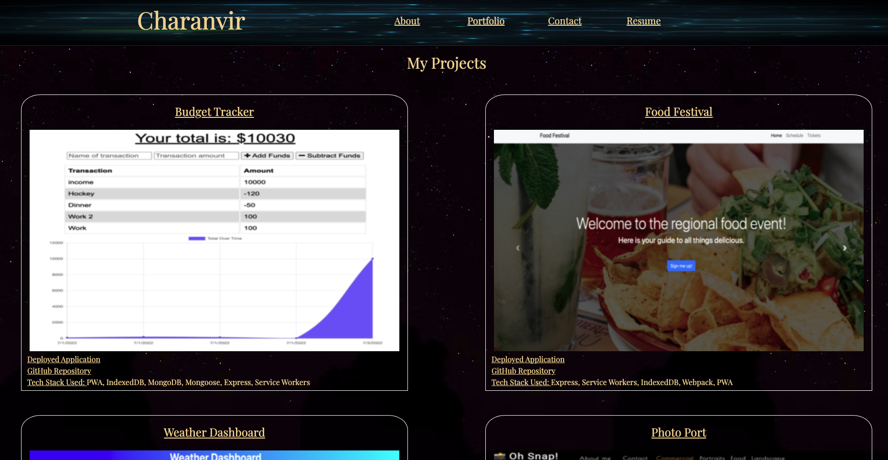

# Official-Portfolio

## Official Portfolio showcasing projects that I have completed and contact information for reaching me.

https://charanvir.github.io/charanvirs-portfolio/

## About Me
The About Me Section gives a small background about myself and my current hobbies and goals with development/coding.

## Portfolio
The Portfolio Section includes a number of projects that showcase my skills. Each project has links to the deployed application and the GitHub repository of each project. It also shows the main languages/frameworks/techniques that are used in each project.

## Contact Me
The Contact Page includes a form (pending functionality) and displays contact information for reaching out to me. 
You can contact me at charanvir123@gmail.com, or 647-239-2655

## Resume/Skills
The Resume Page of the portfolio includes a link to a downloadable link to my resume. It also displays the every growing frontend and backend skills that I current possess. 

## Some of the projects found in my Portfolio
The following are the GitHub repositories of some of the projects that are shows in the Portfolio section.
- Budget Tracker: https://github.com/Charanvir/Budget-Tracker
- Food Festival: https://github.com/Charanvir/Food-Festival
- Weather Dashboard: https://github.com/Charanvir/Weather-Dashboard
- Photo Port: https://github.com/Charanvir/photo-port
- dEv Commerce: https://github.com/Charanvir/E-Commerce-Website

Below is a screenshot of my Portfolio:
- 